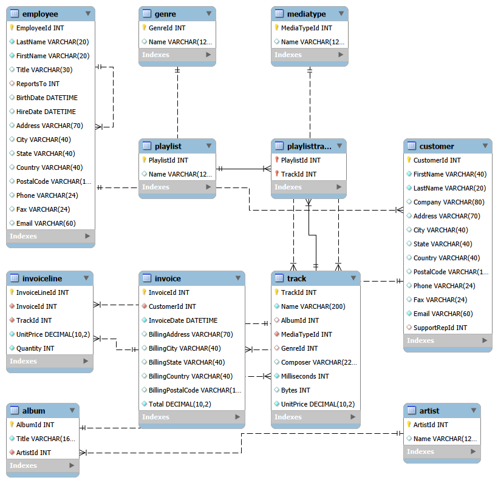

# Analyse SQL des ventes d'un magasin de musique en ligne (base Chinook)

Projet d'analyse de données réalisé avec **MySQL** sur la base **Chinook**, qui simule l'activité d'une boutique de musique en ligne : 59 clients dans 24 pays, 3 503 morceaux au catalogue et 412 factures de janvier 2021 à décembre 2025.

## Contexte

Le directeur de la boutique constate que les ventes sont stables depuis cinq ans mais ne progressent plus. Il doit décider où investir l'année prochaine et m'a posé six questions business. Chaque question a été traduite en requêtes SQL, puis en conclusions et recommandations.

## Synthèse pour le directeur

| # | Question | Réponse | Recommandation |
|---|---|---|---|
| 1 | Qu'est-ce qui se vend ? | 4 genres (Rock, Latin, Metal, Alternative & Punk) font **73,5 %** du chiffre d'affaires. Le Rock seul en représente 35,5 %. | Concentrer le catalogue et la publicité sur ces 4 genres. Étudier les vidéos (séries TV), qui rapportent 2 fois plus par vente. |
| 2 | Qu'est-ce qui ne se vend pas ? | **1 519 morceaux sur 3 503 (43 %)** n'ont jamais été vendus. Aucun morceau n'a été vendu plus de 2 fois. Opéra, Alternative et Electronica ont la plus faible rotation. | Trier le catalogue morceau par morceau plutôt que supprimer des genres entiers. |
| 3 | Où sont nos clients ? | USA et Canada regroupent **36 %** des clients. La dépense par client est presque identique partout (37 $ à 47 $). | Le levier de croissance est le **recrutement de nouveaux clients**, pas la recherche de pays plus dépensiers. |
| 4 | Qui sont nos meilleurs clients ? | Helena Holý (République tchèque) est la meilleure cliente (49,62 $). **13 clients (22 %)** n'ont rien acheté en 2025, dont le 3e meilleur client. | Relancer en priorité les clients inactifs à forte valeur. Suivre les clients sans achat depuis 6 mois. |
| 5 | L'équipe commerciale est-elle efficace ? | Jane Peacock génère le plus de CA (833 $), mais elle suit plus de clients. Par client, les 3 employés sont très proches (38,77 $ à 40,01 $). | Évaluer l'équipe sur le CA par client et répartir les nouveaux clients de façon équilibrée. |
| 6 | Y a-t-il une saisonnalité ? | Non : tous les mois se situent entre 186 $ et 201 $ (écart de 8 %). | Planifier les promotions selon d'autres critères, et tester une campagne de fin d'année. |

## Structure de la base

La vente passe par plusieurs tables reliées entre elles :

- **Customer** (client) → **Invoice** (facture) → **InvoiceLine** (ligne de facture, un morceau vendu)
- **InvoiceLine** → **Track** (morceau) → **Album** → **Artist** (artiste)
- **Track** → **Genre**
- **Customer** → **Employee** (employé du support, via `SupportRepId`)

## Fichiers du projet

| Fichier | Contenu |
|---|---|
| `01_exploration.sql` | Découverte des tables, des colonnes et de la période couverte |
| `02_analyses_base.sql` | Chiffres clés, CA par année, par pays, meilleurs clients |
| `03_analyses_produits.sql` | Questions 1 et 2 : genres, artistes, morceaux jamais vendus, taux de rotation |
| `04_analyses_clients.sql` | Questions 3 et 4 : clients par pays, panier moyen, CA par client, clients inactifs |
| `05_analyses_employes.sql` | Question 5 : performance de l'équipe commerciale |
| `06_analyses_saisonnalite.sql` | Question 6 : chiffre d'affaires par mois |

## Compétences SQL utilisées

- Jointures multiples (`JOIN ... USING`, `JOIN ... ON`)
- `LEFT JOIN` + `IS NULL` pour trouver ce qui n'existe pas (morceaux jamais vendus)
- Agrégations (`SUM`, `COUNT`, `COUNT(DISTINCT)`, `AVG`) et `GROUP BY`
- Indicateurs calculés : CA par client, panier moyen, taux de rotation
- Fonctions de date (`YEAR`, `MONTH`, `DATEDIFF`)

## Limites de l'analyse

Chinook est une base d'exemple : les ventes y sont générées de façon très régulière (environ 83 factures par an, 33 à 35 par mois). Les conclusions sur la stabilité et l'absence de saisonnalité reflètent en partie cette construction. Plusieurs pays n'ont qu'un seul client, ce qui rend les comparaisons par pays fragiles.

## Outils

MySQL 8, MySQL Workbench.

## Auteur

**Christian Nguemewe**, Junior Data Analyst
[LinkedIn](https://linkedin.com/in/christian-nguemewe) · [GitHub](https://github.com/christiannguemewe4-creator)
